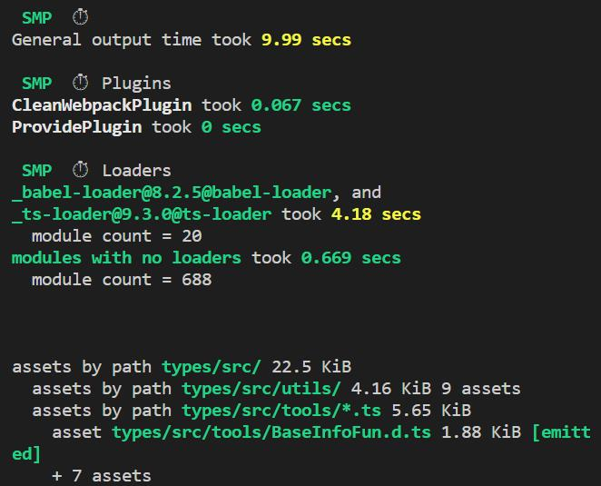
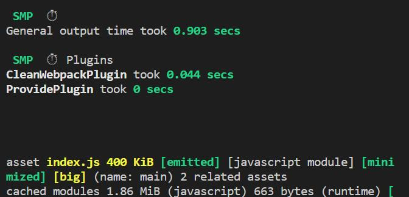
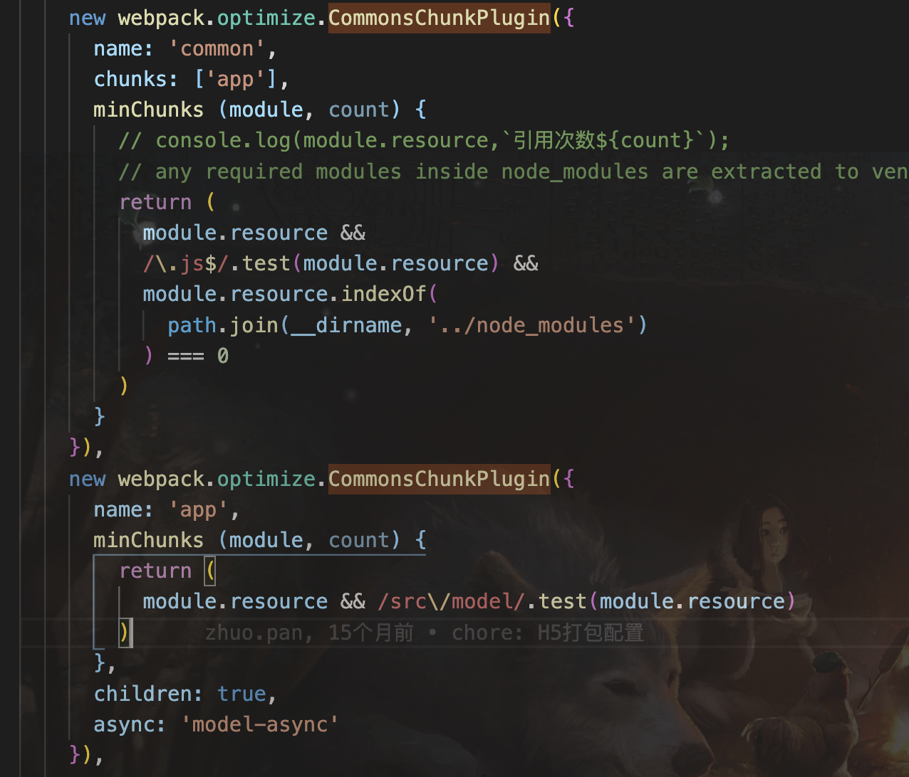

### 打包速度优化
<!-- 利用缓存，多线程打包，精准匹配文件，使用新版本webpack，剔除无用配置, 按环境区分打包配置 -->
1. speed-measure-webpack-plugin
> 作用： 用于查看各loader和plugin的运行时长，根据插件和loader的运行时长针对性去优化

- 使用：
```
const SpeedMeasurePlugin=require('speed-measure-webpack-plugin')
const smp = new SpeedMeasurePlugin();

module.exports = smp.wrap({
    <!-- webpack打包配置 -->
})
```

- 四合一项目webpack.prod.config.js运行图片


2.  loader配置优化
- 打包频率
    + exclude: /node_modules/
    + include: path.resolve(__dirname, '../src')只对src下的进行打包

- 开启babel-loader缓存配置，降低二次构建的时间
> 坑点：会将资源存放在浏览器cache的cache storage中，再次访问直接加载缓存中的资源，因此关掉启动项目，还是可以访问到页面

```
 <!-- babal-loader 缓存配置 -->

 {
   test:/\.(js)$/,
   exclude:/node_modules/,
   loader:'babel-loader',
   options:{
     presets:['@babel/preset-env'],
     cacheDirectory:true
    }
}
```
webpack4以下版本推荐使用cacheDirectory配置，webpack5的版本推荐使用cache配置缓存

----
<!--  webpack5中如何配置cache -->
- webpack5中配置cache缓存

```
基本配置介绍：
module.exports = {
  cache: {
    type: "filesystem", // 使用文件缓存
    buildDependencies: { // 是将哪些文件 or 目录作为 buildDependencies 如果文件发生改变，则缓存失效
      config: [__filename]
    }
  },
};

```
第一次构建：


第二次构建：


cache配置缓存的优势：

1：开箱即用

2：基于 content hash 的缓存对比策略，即 timestamp + content hash

----
-  多线程提高构建速度

> 多线程提高构建速度，针对耗时较长的loader配置单独的worker池，可以同步其他loader构建
>> happypack-plugin 适用于webpack3以下版本
>> thread-loader 适用webpack4以上版本

+ 四合一项目-build开启happypack

```
1. happypack的配置
<!-- happypack的配置 -->
plugins: [
  new HappyPack({
    // 用id，来代表当前的HappyPack是用来处理一类特定的文件
    id: 'babel',
    // 如何处理.js文件，用法和Loader配置中一样
    loaders: [{
      path: 'babel-loader',
      cache: true,
    }],
    threadPool: HappyPackThreadPool,
  }),
  new HappyPack({
    // 用id，来代表当前的HappyPack是用来处理一类特定的文件
    id: 'vue',
    loaders: [
      {
        loader: 'vue-loader',
        options: {
          ...vueLoaderConfig,
          ts: [ 
            'ts-loader'
          ]
        }
      }
    ],
    threadPool: HappyPackThreadPool,
  }),
],


```

<!-- threadloader配置 -->
+ thread-loader的基本配置
```
module.exports = {
  module: {
    rules: [
      {
        test: /\.js$/,
        include: path.resolve("src"),
        use: [
          "thread-loader",
          "babel-loader"
        ]
      }
    ]
  }
}
```

3: 通过配置 resolve/module 减少打包时间
- symlinks
> 不使用npm link的情况下直接关掉会减少解析工作量 四合一项目关闭后打包时间减少两秒左右
```
module.exports = {
    resolve: {
        symlinks: false,
    },
}
```


----
- dll 动态链接库
>  web项目引入动态链接库的目的是  减少第三方模块被重复编译时的时间

webpack5之后推荐使用cache配置缓存，本质上都是缓存文件二次打包时对比使用

----
- 减少查找过程
```
1. 配置文件查找顺序的优先级,页面脚本引入文件时不写后缀时更快查找
resolve: {extension: ['js', 'jsx']}
2. 设置文件夹默认默认入口文件,减少搜索步骤
resolve: {mainFiles: ['index']}    
```
- 配置无需解析的模块但会被打包到最终的bundle中
```
module: {
    // 配置无需解析的模块
    noParse: [/vue\.min\.js$]
}
```
----
- 资源模块处理字体图标

代替file-loader/url-loader/raw-loader ，减少 loader 配置数量，减少了打包时间
```
 module: {
   rules: [
     {
       test: /\.png/,
       type: 'asset/resource'
     }
   ]
 },
```

----
### 前端性能优化
<!-- 代码压缩 代码分离 gzip 文件hash值配置合理利用浏览器缓存 sourcemap -->
1. 公用代码抽离，避免首屏bundle文件过大，减少加载时长
>   wp3以下： CommonsChunkPlugin
>   wp4以上： SplitChunksPlugin


-  CommonsChunkPlugin 
```
entry配置的入口： entry chunk
child chunk：入口a依赖文件b  b为 child chunk
common chunk: 插件分离的公共chunk  
参数说明：
name：合并/创建的chunk名字

filename：指定commons chunk的文件名

chunks：指定从哪些chunk当中去找公共模块，默认是entry chunks

minChunks：数字 、 inifinity（3） 、函数 ：模块满足条件会被提取成公共chunk

children： 通过entry chunk 切割的children chunk作为 source chunk （细化抽离的范围）

async: 配合children属性 用于生产新的common chunk 当 children chunk被加载时异步加载
```



- SplitChunksPlugin

    > 解决了入口文件过大的问题还能有效自动化的解决懒加载模块之间的代码重复问题

```
module.exports = {
  splitChunks: {
    // include all types of chunks
    chunks: "all",
    // 重复打包问题
    cacheGroups: {
      vendors: {
        // node_modules里的代码
        test: /[\\/]node_modules[\\/]/,
        chunks: "all",
        // name: 'vendors', 一定不要定义固定的name
        priority: 10, // 优先级
        enforce: true,
      },
    },
  },
};
```

2. 第三方类库使用cdn

- externals

>   开发npm包时  将一些项目中依赖的包如 axios vue 这些加入这个置  不进行打包处理 减少bundle体积

```
externals: {  
  jquery:'jQuery',
},
```

3. js代码压缩
- webpack5以上： terser-webpack-plugin 

优势：

1、webpack5内置开箱即用

2、默认开启parallel 多进程并发运行压缩

3、无需再配置ParallelUglifyPlugin进行多进程打包，减少了插件运行时间

```
const TerserPlugin = require("terser-webpack-plugin");
module.exports = {
  optimization: {
    minimizer: [
      new TerserPlugin({
        parallel: 4, // 并发运行的默认数量： os.cpus().length - 1 
        terserOptions: {},
      }),
    ],
  },
};
```
- webpack4.7.0以下： UglifyJsPlugin ,以后的版本中被移除

```
npm install uglifyjs-webpack-plugin --save-dev
const UglifyJsPlugin = require('uglifyjs-webpack-plugin');

module.exports = {
  optimization: {
    minimizer: [new UglifyJsPlugin()],
  },
};
```
4. css压缩分离
- webpack5： CssMinimizerWebpackPlugin 压缩

优势：在 source maps 和 assets 中使用查询字符串会更加准确，支持缓存和并发模式下运行

```
const MiniCssExtractPlugin = require("mini-css-extract-plugin");
const CssMinimizerPlugin = require("css-minimizer-webpack-plugin");

module.exports = {
  module: {
    rules: [
      {
        test: /.s?css$/,
        use: [MiniCssExtractPlugin.loader, "css-loader", "sass-loader"],
      },
    ],
  },
  optimization: {
    minimizer: [
      new CssMinimizerPlugin({
        parallel: 4,
      }),
    ],
  },
  plugins: [new MiniCssExtractPlugin()],
};
```
- webpack4及以下： optimize-css-assets-webpack-plugin

```
var OptimizeCssAssetsPlugin = require('optimize-css-assets-webpack-plugin');
const MiniCssExtractPlugin = require('mini-css-extract-plugin');

module.exports = {
  module: {
    rules: [
      {
        test: /\.css$/,
        loader: MiniCssExtractPlugin.extract('style-loader', 'css-loader')
        loader: MiniCssExtractPlugin.loader,
        options: {publicPath: '/public/path/to/' }
      }
    ]
  },
  plugins: [
    new ExtractTextPlugin('styles.css'),
    //new OptimizeCssAssetsPlugin()
    new OptimizeCSSAssetsPlugin({
      assetNameRegExp: /\.css$/g,
      cssProcessor: require('cssnano'),
      cssProcessorPluginOptions: {
        preset: ['default', { discardComments: { removeAll: true } }],
      },
      canPrint: true
    }),
  ]
};
```
### source map 

### 文件hash值


<a src="https://juejin.cn/post/7127303956400701470"></a>
https://zhuanlan.zhihu.com/p/406222865
https://blog.csdn.net/lin_fightin/article/details/115494427

<!-- CommonsChunkPlugin -->
https://segmentfault.com/a/1190000012828879

<!-- 3-5配置对比 -->
https://zhuanlan.zhihu.com/p/451435548