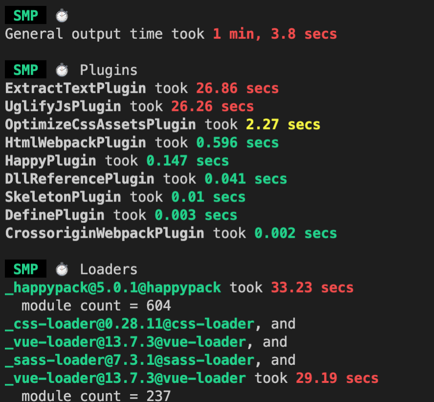
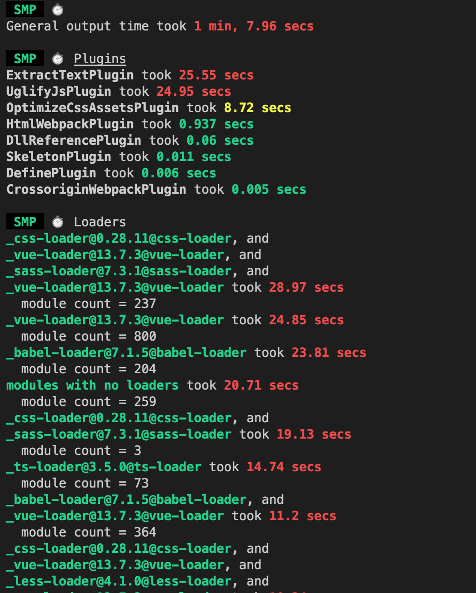

### 打包速度优化
1. speed-measure-webpack-plugin
> 作用： 用于查看各loader和plugin的运行时长，根据插件和loader的运行时长针对性去优化

- 使用：
```
const SpeedMeasurePlugin=require('speed-measure-webpack-plugin')
const smp = new SpeedMeasurePlugin();

module.exports = smp.wrap({
    <!-- webpack打包配置 -->
})
```

- 四合一项目webpack.prod.config.js运行图片


2.  loader配置优化
- 打包频率
    + exclude: /node_modules/
    + include: path.resolve(__dirname, '../src')只对src下的进行打包

- 开启babel-loader缓存配置，降低二次构建的时间
> 坑点：会将资源存放在浏览器cache的cache storage中，再次访问直接加载缓存中的资源，因此关掉启动项目，还是可以访问到页面
webpack4以下版本配置会有一定效果，webpack5的版本只是用cache配置效果更好

```
 <!-- babal-loader 缓存配置 -->

 {
   test:/\.(js)$/,
   exclude:/node_modules/,
   loader:'babel-loader',
   options:{
     presets:['@babel/preset-env'],
     cacheDirectory:true
    }
}
```
<!-- todo webpack5中如何配置cache -->

- 减少查找过程
    + 配置文件查找顺序的优先级,页面脚本引入文件时不写后缀时更快查找
    ```
    resolve: {extension: ['js', 'jsx']}
    ```  
    + 设置文件夹默认默认入口文件,减少搜索步骤
    ```
    mainFiles: ['index']
    ```

-  thread-loader/happypack-plugin
> 多线程提高构建速度，针对耗时较长的loader配置单独的worker池，可以同步其他loader构建
thread-loader 适用webpack5版本
happypack-plugin 适用于webpack3以下版本

+ 四合一项目-build开启happypack

```
<!-- happypack的配置 -->
plugins: [
  new HappyPack({
    // 用id，来代表当前的HappyPack是用来处理一类特定的文件
    id: 'babel',
    // 如何处理.js文件，用法和Loader配置中一样
    loaders: [{
      path: 'babel-loader',
      cache: true,
    }],
    threadPool: HappyPackThreadPool,
  }),
  new HappyPack({
    // 用id，来代表当前的HappyPack是用来处理一类特定的文件
    id: 'vue',
    loaders: [
      {
        loader: 'vue-loader',
        options: {
          ...vueLoaderConfig,
          ts: [ 
            'ts-loader'
          ]
        }
      }
    ],
    threadPool: HappyPackThreadPool,
  }),
],

<!-- threadloader配置 -->

```


3: 通过配置 resolve 减少打包时间
- symlinks
> 不使用npm link的情况下直接关掉会减少解析工作量 四合一项目关闭后打包时间减少两秒左右
```
module.exports = {
    resolve: {
        symlinks: false,
    },
}
```



### 前端性能优化
1. 公用代码抽离
> commonChunkPlugin/SplitChunksPlugin
wp3以下： commonChunkPlugin
wp4以上: SplitChunksPlugin

```
module.exports = {
  splitChunks: {
    // include all types of chunks
    chunks: "all",
    // 重复打包问题
    cacheGroups: {
      vendors: {
        // node_modules里的代码
        test: /[\\/]node_modules[\\/]/,
        chunks: "all",
        // name: 'vendors', 一定不要定义固定的name
        priority: 10, // 优先级
        enforce: true,
      },
    },
  },
};
```
<!-- todo 配一张四合一项目使用commonChunkPlugin的效果时间图 -->

2. 第三方类库使用cdn
> 
### source map 

### 文件hash值


<a src="https://juejin.cn/post/7127303956400701470"></a>
https://zhuanlan.zhihu.com/p/406222865
https://blog.csdn.net/qq_41903941/article/details/120067486
https://blog.csdn.net/lin_fightin/article/details/115494427