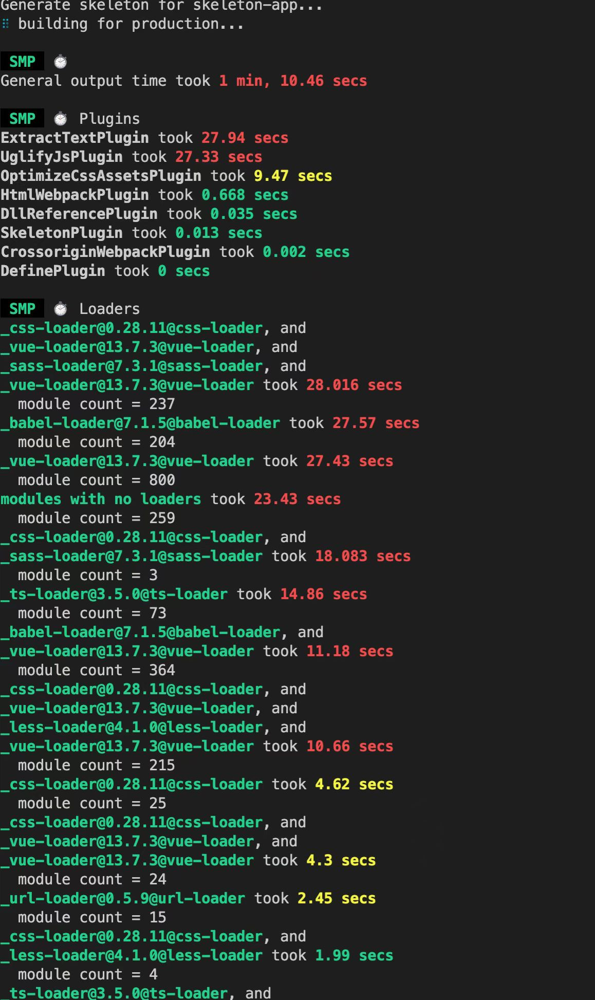

### 打包速度优化
1. speed-measure-webpack-plugin
> 作用： 用于查看各loader和plugin的运行时长，根据插件和loader的运行时长针对性去优化

- 使用：
```
const SpeedMeasurePlugin=require('speed-measure-webpack-plugin')
const smp = new SpeedMeasurePlugin();

module.exports = smp.wrap({
    <!-- webpack打包配置 -->
})
```

- 四合一项目webpack.prod.config.js运行图片



2.  loader配置优化
- 打包频率
    + exclude: /node_modules/
    + include: path.resolve(__dirname, '../src')只对src下的进行打包
- 开启babel-loader缓存配置
> 坑点：会将资源存放在浏览器cache的cache storage中，再次访问直接加载缓存中的资源，因此关掉启动项目，还是可以访问到页面
```
 {
   test:/\.(js)$/,
   exclude:/node_modules/,
   loader:'babel-loader',
   options:{
     presets:['@babel/preset-env'],
     cacheDirectory:true
    }
}
```
- 减少查找过程
    + 配置文件查找顺序的优先级,页面脚本引入文件时不写后缀时更快查找
    ```
    resolve: {extension: ['js', 'jsx']}
    ```  
    + 设置文件夹默认默认入口文件,减少搜索步骤
    ```
    mainFiles: ['index']
    ```
<a src="https://juejin.cn/post/7127303956400701470"></a>
### 前端性能优化